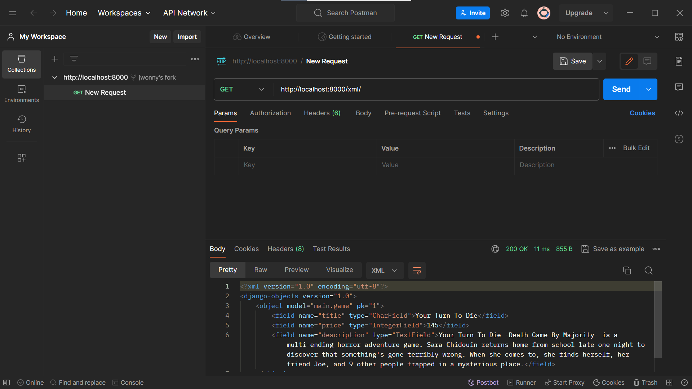
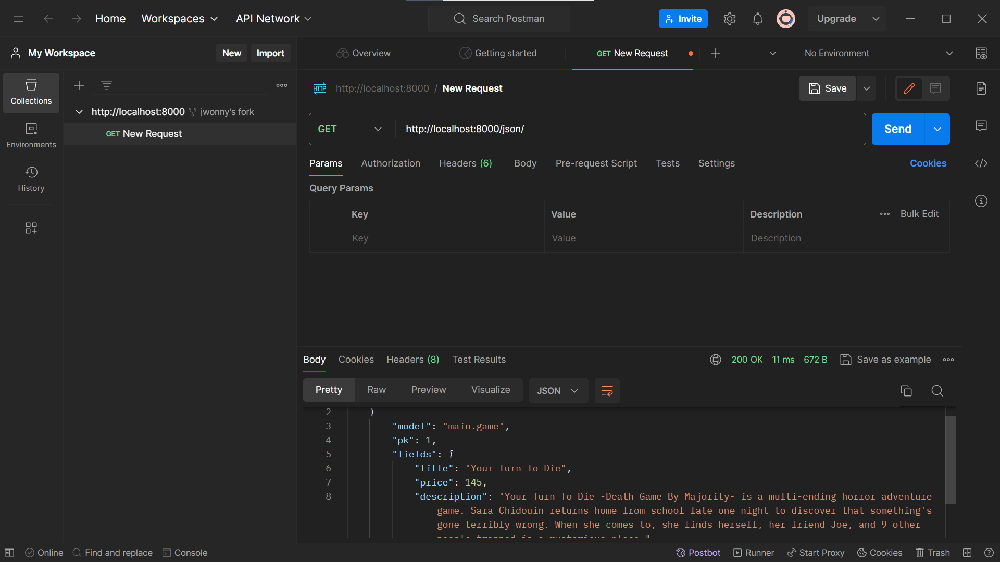
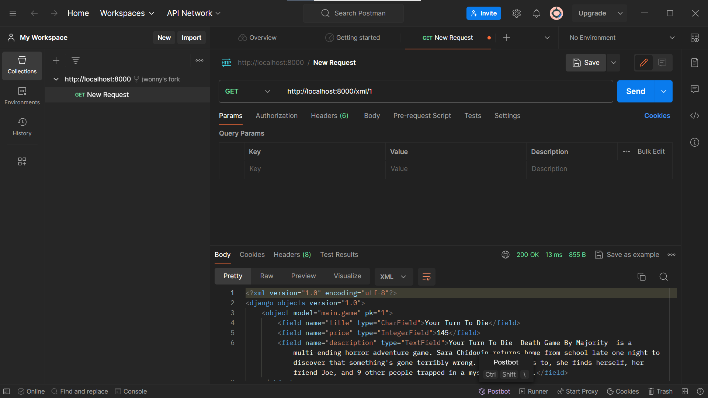
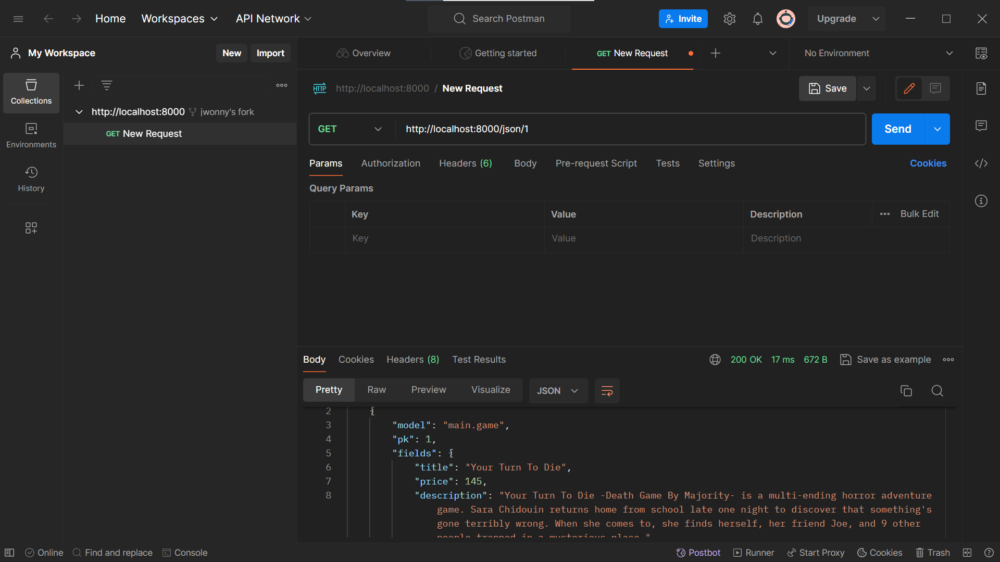

1) Jelaskan bagaimana cara kamu mengimplementasikan checklist di atas secara step-by-step (bukan hanya sekadar mengikuti tutorial).
- Pertama, membuat projek Django dengan cara mengaktifkan virtual environment, menyiapkan dependencies, lalu mengizinkan akses kepada semua host.
- Kedua, membuat aplikasi main dengan cara menjalankan perintah startapp dan menginisiasikan main sebagai aplikasi baru kemudian didaftarkan ke dalam proyek.
- Ketiga, mengatur routing agar aplikasi main dapat diakses melalui web browser dengan cara menghubungkannya dengan rute URL.
- Keempat, membuat model dalam aplikasi main dengan mendefinisikan model ke dalam projek Django terlebih dahulu.
- Kelima, membuat fungsi view dengan merender dengan data yang diambil dari model.
- Keenam, mengonfigurasi routing agar aplikasi main dapat diakses dari web browser dengan cara mengatur URL kemudian menambahkan rute URL.
- Ketujuh, melakukan deployment ke PWS. Namun saya tidak dapat login ke PWS. Maka dari itu, saya mohon maaf dikarenakan checklist ini tidak saya penuhi.

2) Buatlah bagan yang berisi request client ke web aplikasi berbasis Django beserta responnya dan jelaskan pada bagan tersebut kaitan antara urls.py, views.py, models.py, dan berkas html.

3) Jelaskan mengapa kita menggunakan virtual environment? Apakah kita tetap dapat membuat aplikasi web berbasis Django tanpa menggunakan virtual environment?
- Tidak, namun dengan adanya virtual environment dapat menghindari konflik apabila sedang mengerjakan berbagai projek.
  
4) Jelaskan apakah itu MVC, MVT, MVVM dan perbedaan dari ketiganya.
- MVC adalah singkatan dari Model-View-Controller. MVT adalah singkatan dari Model-View-Template. MVVM adalah singkatan dari Model-View-ViewModel
- Perbedaan antara MVC, MVT, dan MVVM yaitu pada bagian Controller, Template, dan juga ViewModelnya. Controller pada MVC berfungsi sebagai alat komunikasi antar view dan model.
Template pada MVT berfungsi untuk mengatur tampilan UI (user interface). ViewModel pada MVVM berfungsi untuk menghubungkan View dan Model.

-------------------------------------------------------------------------------------------------------

1) Apa perbedaan antara form POST dan form GET dalam Django?
2) Apa perbedaan utama antara XML, JSON, dan HTML dalam konteks pengiriman data?
3) Mengapa JSON sering digunakan dalam pertukaran data antara aplikasi web modern?
4) Jelaskan bagaimana cara kamu mengimplementasikan checklist di atas secara step-by-step (bukan hanya sekadar mengikuti tutorial).

